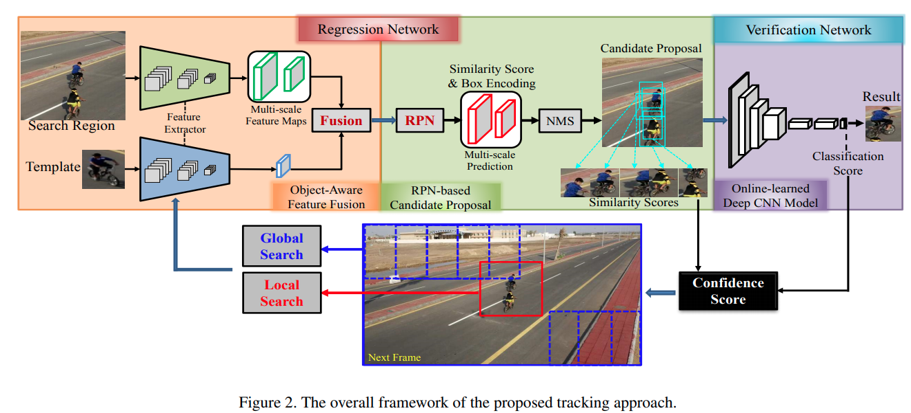
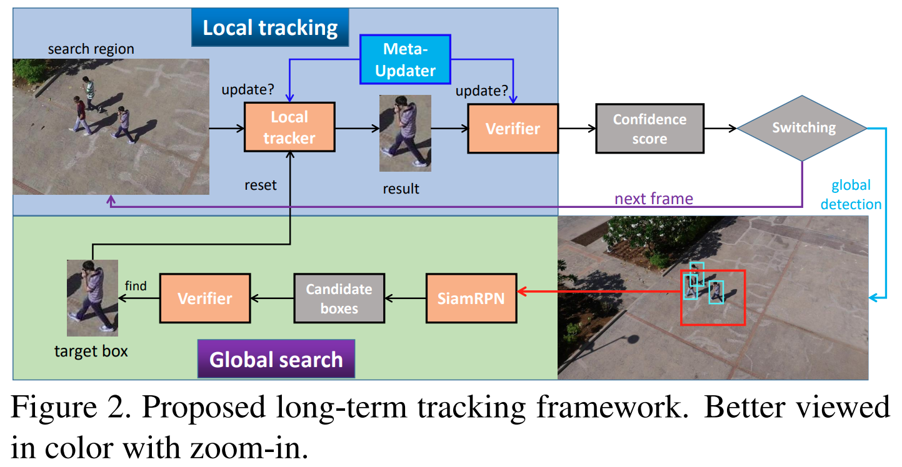

pdf_source: https://arxiv.org/pdf/2004.00305.pdf
code_source: https://github.com/Daikenan/LTMU
time: 20210416

# High-Performance Long-Term Tracking with Meta-Updater

长时跟踪是一个与短期跟踪截然不同的领域，重点在于实现长时间、不漂移、物体图像变化的情况。这里结合这篇paper说明一下相关做法.

## Priors

图像上长时间跟踪与短时间跟踪相比一个突出的难点在于物体的形态、光照等会持续地变化, 因而理论上来说需要时不时或者持续的更新被跟踪的目标的template / embedding. 但是如果每时每刻都进行更新，则跟踪系统可能会随着噪音的持续加入而漂移。因而对于template的管理是一个比较重要的话题.

本文之前的 MBMD架构 [pdf](https://arxiv.org/pdf/1809.04320.pdf)

它额外生成一个confidence score来判断是否需要进行全局搜索并更新template，否则继续局部搜索

## Structures

MBMD的问题在于虽然 long-term tracking 是与 short-term tracking 不同，但是目前阶段如果能复用 short-term tracking 开发的tracker去提升tracking能力，那么还是能对性能有很大提升的。本文提出了全新的框架把 short-term tracking进行了嵌套.并使用meta-updater 指引局部tracker的更新.

1. 整体框架和MBMD一样，有一个verifier确认当前小区域内物体的存在，且正确tracked。跟踪算法由局部的local-tracker决定.
2. 在local tracking部分，有一个meta-updater, 使用LSTM存着时序信息指引 local tracker的更新. 

Meta-updater的输入是 框的位置大小，Response Map, 以及它与 template的相似度。

