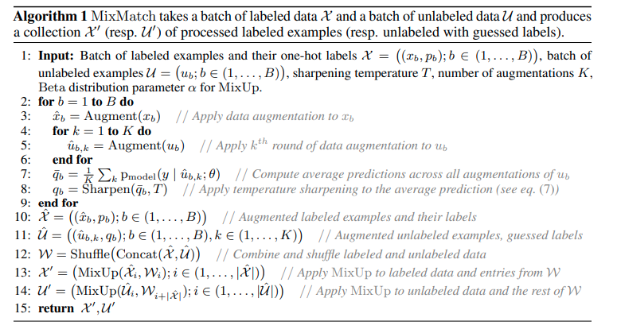

time: 20201022
pdf_source: https://arxiv.org/pdf/1905.02249.pdf

# MixMatch: A Holistic Approach to Semi-Supervised Learning

这篇paper介绍了MixMatch算法，其是一个性能很强的 semi-supervised learning方法。在这里的semi-supervised指的是使用较少的labelled data以及大量的unlabel data进行训练。

有一个比较清晰的[知乎文章](https://zhuanlan.zhihu.com/p/66281890)，介绍了这个算法的来龙去脉.

## Primary Algorithms

### 自洽正则化 (Consistency Regularization)

这个是一个通用的扩展数据的方案, 也在 [SSL-RTM3D](../../3dDetection/SSL_RTM3D.md)中使用了，也就是使用数据增强后，网络对增强后的数据的预测应该是自洽的，作者用这个方法来训练网络在未标注数据上的泛用性.

- $L_{mathcal{U}} = \frac{1}{L|\mathcal{U'}|} \underset{u, q \in \mathcal{U'}}{\sum} ||q - p_{model}(y | u;\theta)||^2_2$

这里虽然是要求概率上靠拢，但是使用的并不是基于概率值与熵的损失函数，而是要求 $L_2$ 损失，这里突出的是 $L_2$损失对常数不敏感，因而是一个更强的约束.

### Entropy Minimization

对于没有标注的数据，作者的方案是让它数据增强多次(K=2)，对输出概率矢量取均值，其中概率最大值为预测的 pseudo-label. 作者指出需要降低预测的熵值，鼓励网络做出判断。

实现上包含
- Label Guessing $\bar q_b = \frac{1}{K} \sum_{k=1}^K p_{model}(y|\hat u_{b,k};\theta)$
- Sharpening: $q_b := p_i^{\frac{1}{T}} / \sum_{j=1}^{L}p_j^{frac{1}{T}}$

### MixUp

这个是一个重要的regularization 算法, 本站在[bag of freebies for object detection](../object_detection_2D/BoFDetection.md)中有引入. 作者这里对labled data, unlabeled data 在训练的时候分别进行 mixup.

## 框架

$$
\begin{aligned}
\mathcal{X}^{\prime}, \mathcal{U}^{\prime} &=\operatorname{MixMatch}(\mathcal{X}, \mathcal{U}, T, K, \alpha) \\
\mathcal{L}_{\mathcal{X}} &=\frac{1}{\left|\mathcal{X}^{\prime}\right|} \sum_{x, p \in \mathcal{X}^{\prime}} \mathrm{H}\left(p, \mathrm{p}_{\text {model }}(y \mid x ; \theta)\right) \\
\mathcal{L}_{\mathcal{U}} &=\frac{1}{L\left|\mathcal{U}^{\prime}\right|} \sum_{u, q \in \mathcal{U}^{\prime}} \| q- p_{model}(y \mid u ; \theta) \|_{2}^{2} \\
\mathcal{L} &=\mathcal{L}_{\mathcal{X}}+\lambda_{\mathcal{U}} \mathcal{L}_{\mathcal{U}}
\end{aligned}
$$