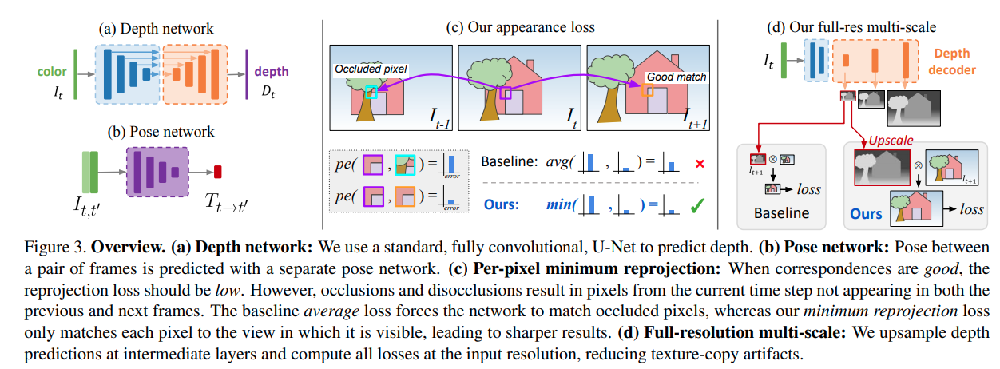
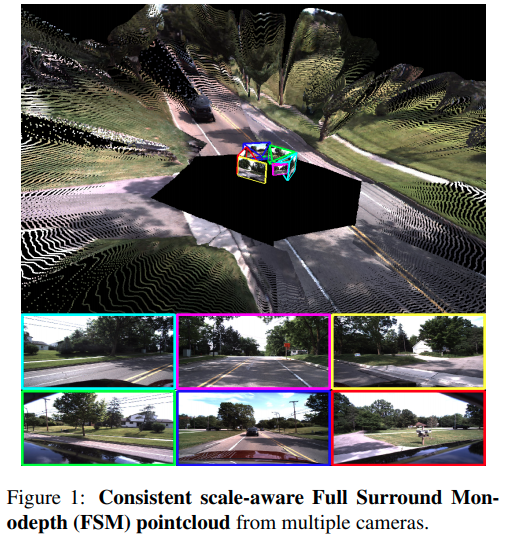
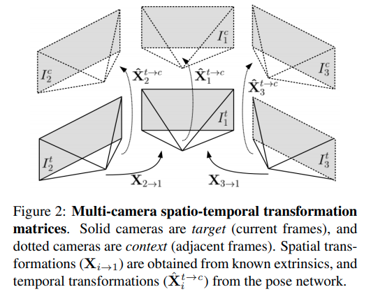

time:20210823
code_source: https://github.com/nianticlabs/monodepth2
pdf_source: https://arxiv.org/pdf/1806.01260.pdf

# Collections on Monodepth (unsupervised)

## MonoDepth2

[pdf](https://arxiv.org/pdf/1806.01260.pdf) [code](https://github.com/nianticlabs/monodepth2)

MonoDepth2是非监督单目深度估计的一个Baseline， 

主要几个思路:

1. 简单的res18以及decoder出深度估计结果.
2. 图片并接直接输出相对pose
3. 用前一帧或者后一帧或者双目的图片重建处当前帧.
4. 重建loss使用 SSIM, 且选择重建的min的loss，重建损失过大的遮挡部分被滤掉了.

## Self-Supervised Monocular Depth Hints

[pdf](https://arxiv.org/abs/1909.09051) [code](https://github.com/nianticlabs/depth-hints)

这篇paper以前面monodepth2的文章为基础，着重提升了在使用stereo pairs进行自监督深度训练时的训练精度。

根据monodepth2, 每个像素的损失函数:

$$
l_{r}\left(d_{i}\right)=\alpha \frac{1-\operatorname{SSIM}\left(I_{i}, \tilde{I}_{i}\right)}{2}+(1-\alpha)\left|I_{i}-\tilde{I}_{i}\right|
$$

这里融入了双目匹配的结果，在单目预测效果比较差的像素给予双目的监督:

$$
l_{\text {ours }}\left(d_{i}\right)=\left\{\begin{array}{ll}
l_{r}\left(d_{i}\right)+l_{s}^{\log L_{1}}\left(d_{i}, h_{i}\right) & \text { if } l_{r}\left(h_{i}\right)<l_{r}\left(d_{i}\right) \\
l_{r}\left(d_{i}\right) & \text { otherwise }
\end{array}\right.
$$

## Full Surround Monodepth from Multiple Cameras

[pdf](https://arxiv.org/pdf/2104.00152.pdf)

1. 提出做多摄像机的深度估计
2. 考虑时序+空间两个方向的consistency
3. 需要self-occlusion mask去掉相机内车体相关的部分，需要non-overlapping areas去除相机之间不重叠的部分.

## Towards Good Practice for CNN-Based Monocular Depth Estimation

[pdf](https://openaccess.thecvf.com/content_WACV_2020/papers/Fang_Towards_Good_Practice_for_CNN-Based_Monocular_Depth_Estimation_WACV_2020_paper.pdf) [code](https://github.com/zenithfang/supervised_dispnet)

## Monocular Depth Prediction through Continuous 3D Loss

[pdf](https://arxiv.org/pdf/2003.09763.pdf) [code](https://github.com/minghanz/c3d)

