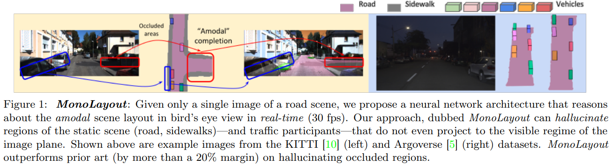
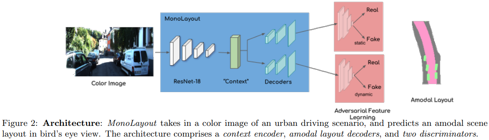

time: 20210911
pdf_source: https://arxiv.org/pdf/2002.08394.pdf
code_source: https://github.com/hbutsuak95/monolayout
short_title: MonoLayout

# MonoLayout: Amodal scene layout from a single image

这篇paper做的是一个和Tesla最新公布的BEV分析方案有一定相关性的任务，即从单目图片到BEV全景分割的映射。

- 数据来自于argoverse的路网，以及KITTI的语义分割加点云投影。
- 同时要由supervised training, 也需要adversarial training来提升视觉效果。
  

网络上使用一个encoder处理图片数据，然后通过reshape,输出动态与静态两个mask， 训练上一方面使用监督，另一方面使用patchGAN对抗训练,

$$
\begin{array}{l}
\min _{\phi, \nu, \psi, \theta_{S}, \theta_{D}} \mathcal{L}_{s u p}(\phi, \nu, \psi)+\mathcal{L}_{a d v}(\phi, \theta, \psi)+\mathcal{L}_{d i s c r}(\phi, \nu) \\
\mathcal{L}_{\text {sup }}=\sum_{i=1}^{N}\left\|\mathcal{S}_{\phi, \nu}\left(\mathcal{I}^{i}\right)-\mathcal{S}_{g t}^{i}\right\|^{2}+\left\|\mathcal{D}_{\phi, \psi}\left(\mathcal{I}^{i}\right)-\mathcal{D}_{g t}^{i}\right\|^{2} \\
\mathcal{L}_{a d v}(S, D ; \phi, \theta, \psi)=\mathbb{E}_{\theta \sim p_{\text {fake }}}\left[\left(D\left(\theta_{S}\right)-1\right)^{2}\right] \\
+\mathbb{E}_{\theta \sim p_{\text {fake }}}\left[\left(D\left(\theta_{D}\right)-1\right)^{2}\right] \\
\mathcal{L}_{\text {discr }}(D ; \theta)=\sum_{\theta \in\left\{\theta_{D}, \theta_{S}\right\}} \mathbb{E}_{\theta \sim p_{\text {true }}}\left[(D(\theta)-1)^{2}\right] \\
+\mathbb{E}_{\theta \sim p_{\text {fake }}}\left[(D(\theta)-1)^{2}\right]
\end{array}
$$

技术细节:

- 分成两个单独的decoder对性能影响很大
- 直接使用UNet效果并不好，还是需要划归为单一矢量重组后再输出。

