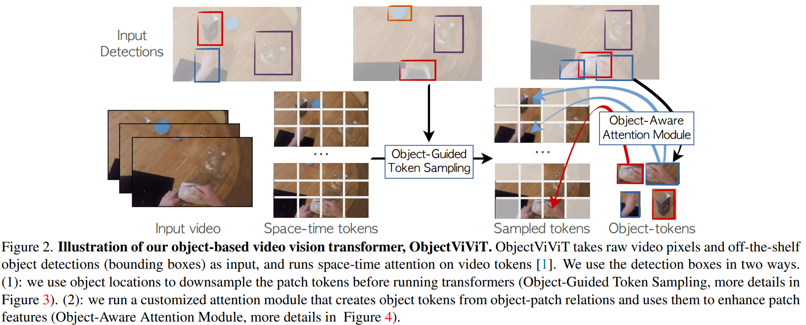

time: 20230622
pdf_source: https://arxiv.org/pdf/2306.11726.pdf
code_source: https://github.com/google-research/scenic/tree/main/scenic/projects/objectvivit

# How can objects help action recognition?

这篇paper讨论的是action recognition中如何使用物体信息，首先相关工作而言，从序列图片中用transformer做行为识别，需要很多的spatial-temporal tokens, 因而运算量比较大。本文的思路在于，对于行为检测而言，人与物体的交互是非常重要的,如何使用物体信息来增强特征，简化运算，是本文的主要考虑点。

## 主要框架

系统的输入包含序列图片与序列图片的目标检测结果。使用ViT计算序列图片的patch tokens. 引入 object-guided-token sampling (OGS)用于筛选出前景token，减轻运算量，引入 object-aware attention module (OAM) 用于时序地增强token特征。

OGS算法如上图，利用Center-net的heatmap渲染方法，把检测出来的前景物体不区分具体种类地渲染为单一Channel的heatmap, 每一个patch token区域内heatmap强度之和为这个token属于前景的得分。 这里选择一个固定的 top K 方法选择前景token，剩下的部分用一个很低的比率随机下采样。

得到每一时间帧token特征$z_t$.使用centernet的heatmap渲染对每一帧、每一个object单独构建一个heatmap $H_{o,t}$，

$$
\mathbf{w}_{o, t}^l=\operatorname{MaxPool}\left(\operatorname{MLP}\left(\widehat{\mathbf{H}}_{o, t} * \widehat{\mathbf{z}}_t^l\right)\right)
$$

把物体的token和特征增强后输入transformer:

$$
\mathbf{y}^l=\operatorname{MHA}\left(\mathbf{z}^l,\left[\mathbf{z}^l, \mathbf{w}^l\right],\left[\mathbf{z}^l, \mathbf{w}^l\right]\right)+\mathbf{z}^l
$$
