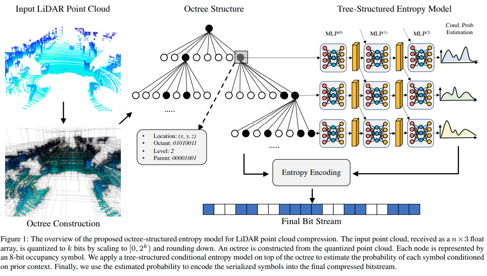

time: 20210710
pdf_source: https://arxiv.org/pdf/2005.07178.pdf

# OctSqueeze: Octree-Structured Entropy Model for LiDAR Compression

这篇paper介绍了一个激光雷达点云的压缩算法，可以用来压缩点云。压缩点云主要是为了减少点云的大小，从而减少激光雷达的存储量以及传输速率。而压缩点云的方法与传统的信息压缩密切相关, 也就是要使用二进制压缩算法尽可能无损地压缩点云为高信息率的二进制流。

如上图所示, 本文首先尝试用一个八分树(oct-tree)来编码整个点云, 八叉树上的每一个点的位置都是pre-defined的，这样就可以用每一层上面的occupancy 0-1二进制串来近似表达整个点云。

如果我们采用一个简单的压缩算法直接对整个八分树上的0-1二进制串进行压缩，那么可以得到一个比较稳定的压缩率；不过由于这样的二进制串没有太多的规律，稀疏度不高，且没有规律，因而信息熵比较大；

本文的idea:

- 用神经网络，使用上一层的节点的特征，预测下一层节点的occupancy probability.
- 在压缩的时候，记录下GT occupancy probability和predicted occupancy probability的差值(0-1序列).如果网路的预测准确率比较高的话，这个0-1序列差值很多都会是0，将会是一个很稀疏的序列，然后用一般的二进制压缩算法(如zip, huffman coding)等可以得到很高的压缩率.
- 在解压缩的时候，让网路在每一层进行概率预测，然后将差值进行解码；将网络的预测值与解码值进行相加，就能无损地还原点云压缩时被输入网络的0-1序列.
- 在尤其是高层的时候，稀疏序列的存储加起来比原来稠密序列的存储要更少，实现压缩。而网络权重则是在不同网络间通用的。

