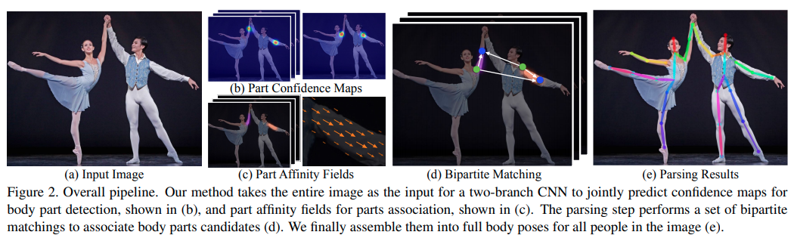
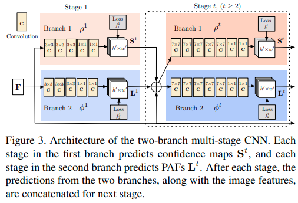
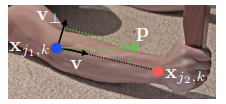
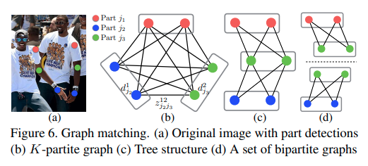

code_source: https://github.com/ZheC/Realtime_Multi-Person_Pose_Estimation
time: 20191225
pdf_source: https://arxiv.org/pdf/1611.08050v2.pdf
short_title: OpenPose: Part Affinity Fields
# Realtime Multi-Person 2D Pose Estimation using Part Affinity Fields
这篇论文是[Open Pose库]迈向实时多人肢体估计的第一篇论文，主要是解决肢体估计中的匹配问题。

## Pose Estimation pipeline

总体框架如图，CNN会输出两个分支，一个分支是关节位置热图，一个分支是局部肢体矢量图(Part Affinity Fields, PAF)。通过NMS得到图中所有人各个关节的位置。再通过PAF推理、分组出各个人各自的关节。

## 网络结构

先使用VGG backbone提出 feature map $F$, 再多个stage 分别输出 $S \in R^{w\times h}, L \in R^{w\times h \times 2}$，不同层之间用concat链接

$$
\begin{aligned}
    S^t &= \rho^t(F, S^{t-1}, L^{t-1}) \\ 
    L^t &= \phi^t(F, S^{t-1}, L^{t-1})
\end{aligned}
$$

## $S$ Confidence map training

每一个有标注的关节，以其坐标为中心，计算一个Gaussian heat map, $S$由不同人同一关节的heat map的最大值组成。

在推理的时候，使用NMS剔除不在最高点的点

## PAF for part association

pipeline中提到过 PAF($L$)是一个2维的向量场图,这里有一个"limb"(肢体)的概念，定义为两个相邻关节之间的连接，作者根据人体特征预定义了一系列的"limb".

距离相邻关节线段最短距离小于一个阈值，同时投影在线段内的点，会带上一个标注，其标注值为这两个关节之间的单位直线矢量,目标的PAF则是同一图中所有人同一limb的均值。

在inference的时候，被一个limb所连接的两个关节之间相互匹配的权重为如下的积分

$$
E = \int^{u=1}_{u=0}L_c(p(u)) \frac{d_{j2} - d_{j1}}{||d_{j2} - d_{j1}||_2} du
$$

其中$p(u)$由双线性插值得到，而实际上的积分也有均匀采样中间点得到。

## 匹配问题

从partition graph的点匹配问题的角度,回顾一下关节点的匹配问题

严格来说，我们需要计算的是如$b$图一样的从$K$个分离图中得到$N$组最优的由$K$个关节组成的匹配组，作者指出这是一个NP难问题.为了在肢体估计这个领域解决这个问题，作者做了一定的简化，也就是只完成对**相邻关节**之间的相互最优匹配而不做**全局**的最优匹配.

相邻的二分离的匹配问题，其权重由前文的PAF计算得到，再用[匈牙利算法](https://www.wikiwand.com/zh/%E5%8C%88%E7%89%99%E5%88%A9%E7%AE%97%E6%B3%95)
完成匹配。如此简化可以指数级地减少运算量，使得算法可使用。

[Open Pose库]:https://github.com/CMU-Perceptual-Computing-Lab/openpose