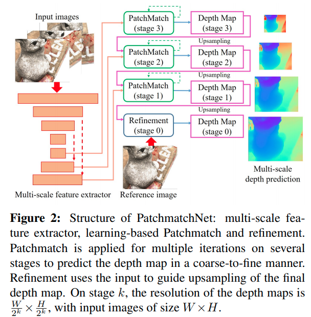
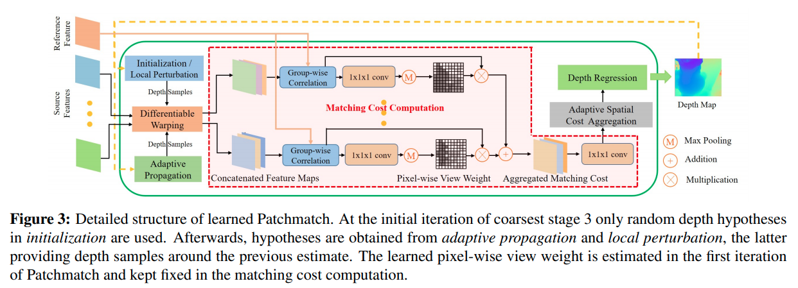

time: 20210409
pdf_source: https://arxiv.org/pdf/2012.01411.pdf
code_source: https://github.com/FangjinhuaWang/PatchmatchNet

# PatchmatchNet: Learned Multi-View Patchmatch Stereo

主要贡献:

1. 减少测试时的运算量以及记忆消耗, 使用coarse-to-fine的层级结构
2. 用可学习模块替换 propagation 和 cost evaluation; 训练中加入randomness, 

## Methods

1. 对N张输入图片，跑FPN，得到多层feature
2. Learnable [Patchmatch](#patchmatch)
3. Depth Map Refinement

### Patchmatch

1. 初始化以及 Pertubation.

在第一个循环， 基于$[d_{min}, d_{max}]$, 分成$D_f$个间隔。在后面的stage, 对每个pixel执行$N_k$个hypotheses, 

见[这篇](../../Building_Blocks/deepPruner.md)

2. Adaptive Propagation

实际做法比DCN还要再复杂一些，首先有一个baseline的5*5卷积核，使用CNN输出一个额外的offset. 但是不太看得出来差距在哪里

3. Differentiable Warping

基于预测的深度以及外参进行sample

