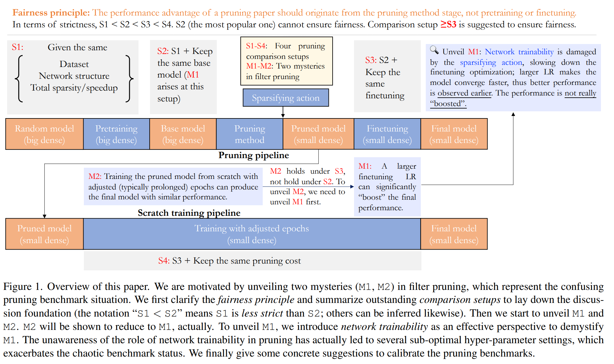

time: 20230116
pdf_source: https://arxiv.org/pdf/2301.05219.pdf
code_source: https://github.com/MingSun-Tse/Why-the-State-of-Pruning-So-Confusing

# Why is the State of Neural Network Pruning so Confusing? On the Fairness, Comparison Setup, and Trainability in Network Pruning

这篇paper指出了现有pruning 方法以及现有benchmark的问题。并且指出了两个奇怪的现象对现有方法提出了质疑：

M1: 在prunining之后进行fine-tuning的时候，如果采用较大的learning rate，可得到比较好的结果。这与fine-tuning的直觉不符合。作者尝试对基础的L1-norm pruning 进行处理，再使用更大的learning rate进行后处理训练，得到了完全不亚于目前SOTA的表现。

M2: 直接对修剪后的模型，从预训练开始重新训练，可能比fine-tuning更长的时间，但是可以得到不亚于fine-tuning的结果。

本文设定了四种等级的fairness principle, 并引入了网络的可训练性 trainability 这个概念来解释。

    To summarize, our results suggest a larger LR does not really “improve” the performance.
    
    What really happens is, a larger LR accelerates the optimization process, making the higher performance observed earlier.

