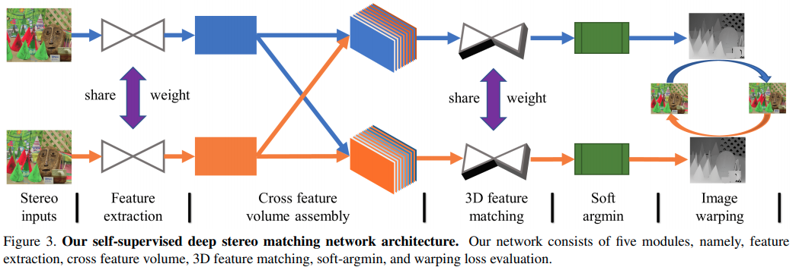
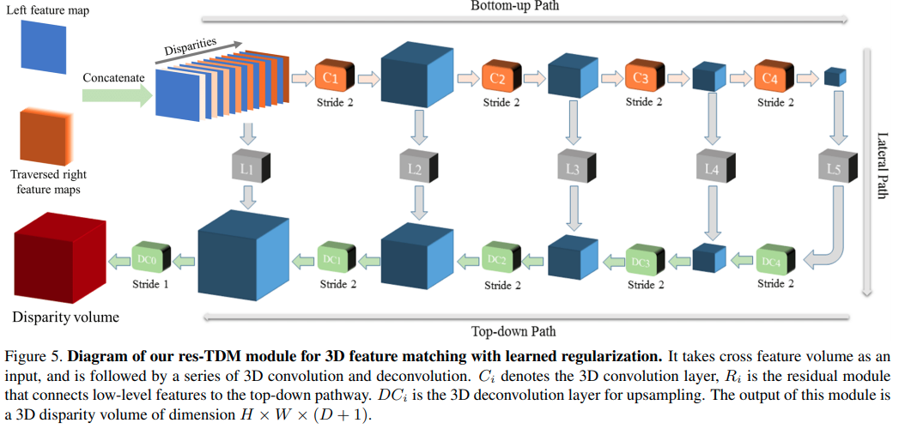
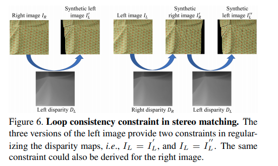

time: 20200430
pdf_source: https://arxiv.org/pdf/1709.00930.pdf
short_title: SsSMnet
# Self-Supervised Learning for Stereo Matching with Self-Improving Ability

这篇paper关注的是自监督双目匹配。重点在于不需要点云监督，而且在新场景测试的时候可以重新迭代进步。

## 网络结构



其中的feature mapping



左右目分别运行对称的网络。

## 损失函数

### 左右图生成一致性


$$\begin{aligned}
\mathcal{L}_{u}^{l}\left(I_{L}, I_{L}^{\prime}\right) &=\frac{1}{N} \sum \lambda_{1} \frac{1-\mathcal{S}\left(I_{L}, I_{L}^{\prime}\right)}{2} \\
&+\lambda_{2}\left|I_{L}-I_{L}^{\prime}\right|+\lambda_{3}\left|\nabla I_{L}-\nabla I_{L}^{\prime}\right|
\end{aligned}$$

分三项，分别是SSIM,左图，图片梯度。

```python
def SSIM(self, x, y):
    C1 = 0.01 ** 2
    C2 = 0.03 ** 2

    mu_x = nn.AvgPool2d(3, 1)(x)
    mu_y = nn.AvgPool2d(3, 1)(y)
    mu_x_mu_y = mu_x * mu_y
    mu_x_sq = mu_x.pow(2)
    mu_y_sq = mu_y.pow(2)

    sigma_x = nn.AvgPool2d(3, 1)(x * x) - mu_x_sq
    sigma_y = nn.AvgPool2d(3, 1)(y * y) - mu_y_sq
    sigma_xy = nn.AvgPool2d(3, 1)(x * y) - mu_x_mu_y

    SSIM_n = (2 * mu_x_mu_y + C1) * (2 * sigma_xy + C2)
    SSIM_d = (mu_x_sq + mu_y_sq + C1) * (sigma_x + sigma_y + C2)
    SSIM = SSIM_n / SSIM_d

    return torch.clamp((1 - SSIM) / 2, 0, 1)
```

### 规范化

平稳性,图片二次梯度

$$\mathcal{L}_{s}^{l}=\frac{1}{N} \sum\left|\nabla_{u}^{2} d_{L}\right| e^{-\left|\nabla_{u}^{2} I_{L}\right|}+\left|\nabla_{v}^{2} d_{L}\right| e^{-\left|\nabla_{v}^{2} I_{L}\right|}$$

### 循环一致性



$$\mathcal{L}_{c}^{L}=\left|I_{L}-I_{L}^{\prime \prime}\right|$$

### Maximum-Depth Heuristic

最小化dispairty的总和。
$$\mathcal{L}_{m}^{L}=\frac{1}{N} \sum\left|d^{L}\right|$$


## 自提升

在测试的时候可以进一步fine-tune网络。性能还能提升

