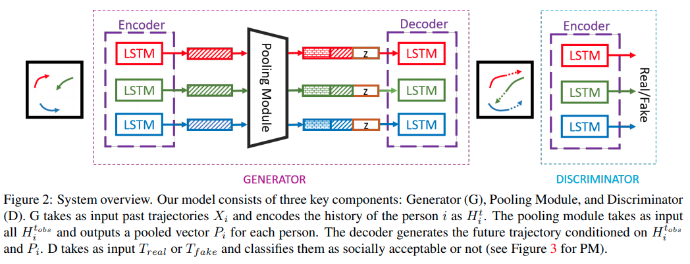

time: 20210809
pdf_source: https://arxiv.org/pdf/1803.10892.pdf
code_source: https://github.com/agrimgupta92/sgan

# Social GAN: Socially Acceptable Trajectories with Generative Adversarial Networks

Social GAN 一个经典的行人轨迹预测网络。 

Motivation:

- 重视人与人之间的交互性
- 人的行为不只是物理可实现，还想要Socially acceptable.
- 人的行为不只有一种可行性，是一个multimodal分布.

$$
\begin{aligned}
e_{i}^{t} &=\phi\left(x_{i}^{t-1}, y_{i}^{t-1} ; W_{e d}\right) \\
P_{i} &=P M\left(h_{d 1}^{t-1}, \ldots, h_{d n}^{t}\right) \\
h_{d i}^{t} &=L S T M\left(\gamma\left(P_{i}, h_{d i}^{t-1}\right), e_{i}^{t} ; W_{\text {decoder }}\right) \\
\left(\hat{x}_{i}^{t}, \hat{y}_{i}^{t}\right) &=\gamma\left(h_{d i}^{t}\right)
\end{aligned}
$$

方法:

- 使用LSTM处理序列输入与输出
- 使用GAN的机制，训练一个分类器来判断序列是否合理，而不是强行overfit 单个真实值。

