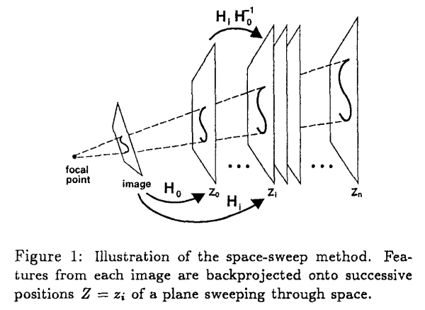

time: 20200218
pdf_source: https://ieeexplore.ieee.org/stamp/stamp.jsp?tp=&arnumber=517097
short_title: Plane sweeping for multi-image matching
# A Space-Sweep Approach to True Multi-Image Matching

这篇作者提出使用 plane sweeping algorithm去处理多图片matching的问题。

首先作者指明，所谓"True Multi-Image Matching"，需要满足三个条件
1. 该方法可以用在任意多的相机中。
2. 算法的复杂度正比于相机的个数。
3. 所有图片在计算上的处理是一致的。

## Plane sweeping

总体框架上来说，space sweep的算法描述的是选取一系列平行的平面。将每一个image上的每一个keypoint投影到每一个平面上。在每一个平面上的所有keypoint进行celluar voting，确定keypoint聚集的3D位置并判断此处确实有一个点。

所以为了高效率地计算，这里需要分别讨论这两个步骤的实现方法。

## 投影

标准的思路是对于每一个平面$z_i$,图片上的每一个keypoint都需要运行一个逆投影，这个方法比较慢，作者提出，可以先将图像点投影到某一个平面$z_0$处，然后再平行的其他平面上的投影可以由两个单应性矩阵$H$变换而得.

$$
\begin{array}{l}
{x_{i}=\delta x_{0}+(1-\delta) C_{x}} \\
{y_{i}=\delta y_{0}+(1-\delta) C_{y}}
\end{array}
$$

$\delta = (z_i - C_z)/(z_0 - C_z)$

$C_x, C_y, C_z = -r_{1} \cdot t, -r_{2} \cdot t, -r_{3} \cdot t$

相当于是使用相似三角形在进行计算。

## voting

严谨来说，同一个point可以给投影点附件一个区域的cell进行投票，理论上来说需要求jacobian。本文最终采取的方式是让距离相同的点投票范围相同，并且为一个constant。也就是说投票的范围、采样概率仅与距离成正比即可。

最终通过阈值设置得到solid 3D point.

