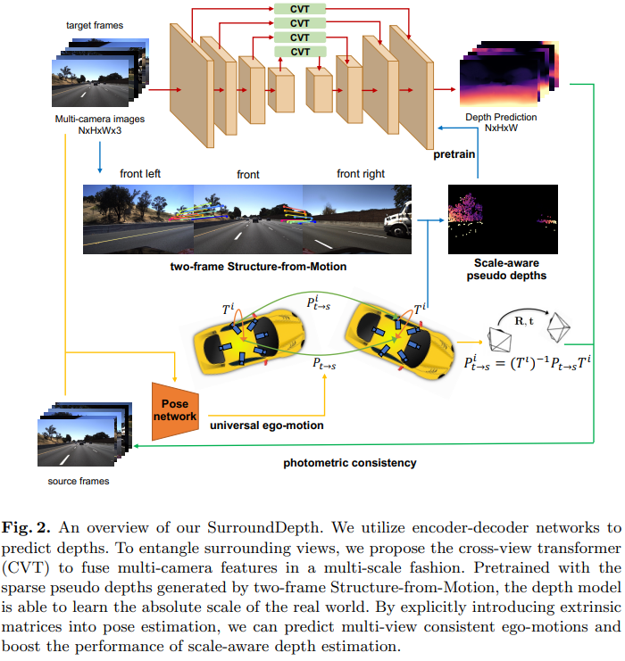

time: 20220607
pdf_source: https://arxiv.org/pdf/2104.00152.pdf

# About Surround Monodepth

本页包含关于环视摄像头的单目深度估计。这个任务与传统的monodepth2的相同与区别:

- 对于一组环视摄像头，每一个摄像头的网络推理都是独立进行的，因此推理方式与monodepth2一致。
- 与monodepth2不同，尽管推理结构只有单个摄像头，网络的输出是带有尺度的深度，反应实际的环境尺度。monodepth2在这个设定下主要关注的是相对深度，而不需要实际环境深度。
- 不同摄像头之间有小部分的可视空间重叠。可以利用重叠部分以及相机之间的外参，获取实际的尺度。
- 采用的数据，主要是nuscenes，以及[toyota的DDAD数据集](https://github.com/TRI-ML/DDAD)

## Full Surround Monodepth from Multiple Cameras
[pdf](https://arxiv.org/pdf/2104.00152.pdf)

- 提出context picture的概念，允许context picture来自于不同帧的不同摄像机位置，只要有重叠空间即可。
- 预测pose的时候，都预测前向摄像头的pose(经常接近于identity transform， 容易预测)， 再根据相机外参把相对位移转到当前预测的摄像头上。可以增强pose预测的准确性。
- 同一帧图片不同摄像机预测的位移，在转到前向坐标系后，应该都是相似的值，所以本文提出pose consistency loss约束同一帧pose的相似性。它与第一点结合可以提升同一帧不同摄像机深度的协调性。
- 加入 non-overlapping area约束重建深度。用torch grid_sample重建图片的时候，如果原来的深度点云在新相机中的投影是在图片外的时候，该函数会取边界点进行插值，在不同摄像机相互监督，或者不同图片间重叠量很少的时候这个mask非常重要。
- 加入 self-occlusion mask, 在一些数据集上，有一部分的车子是会在相机中有投影，在运行中一直跟着车子移动。这篇paper手动地给每一个数据集每一个车子的每一个摄像头画一个mask, 把车子的投影去掉不计算损失。(Nuscenes的后摄像头就有车身的一部分， DDAD的摄像头也可能有)

## SurroundDepth: Entangling Surrounding Views for Self-Supervised Multi-Camera Depth Estimation
[pdf](https://arxiv.org/pdf/2204.03636.pdf) [code](https://github.com/weiyithu/SurroundDepth)

- 使用CVT融合多帧的特征
- 使用SFM pretrain
- 同样发现了直接用pose transformation训练原始初始化的网络是训练不出来的，因而需要sfm做深度预训练。
- 同样需要FSM提到的mask

