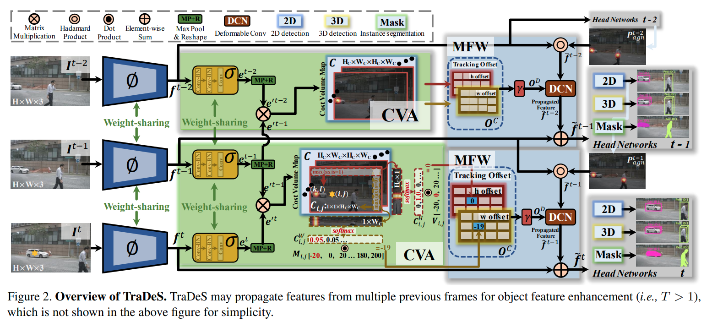

time: 20210317
pdf_source: https://arxiv.org/pdf/2103.08808.pdf
code_source: https://github.com/JialianW/TraDeS
short_title: TraDeS

# Track to Detect and Segment: An Online Multi-Object Tracker

这篇paper以[CenterTrack]为基准. CenterTrack会利用上一帧的预测热图辅助本帧的预测，同时还会输出一个Offset来辅助data association.

本文有两个突破点，第一个是利用类似 [RAFT]的结构端到端学习两帧之间的匹配。然后利用可变形卷积将前一帧的特征融入到本帧中进行预测。

## Model Architecture

特征提取网络采用的是CenterNet, 然后使用几个卷积层以及下采样层输出$e \in \mathbb{R}^{H_C\times W_C\times 128}$. 输出的特征图大小为输入图片的$1/8$. 

Cost Volume 的生成与[RAFT]类似，将两帧图各个特征相互内积，得到Cost Volume$C\in \mathbb{R}^{H_C\times W_C\times H_C\times W_C}$.

$$
    C_{i,j,k,l} = e^{'t}_{i,j} e^{'t-\tau}_{k,l}
$$

Offset的输出方法: 先对两个方向分别做Maxpooling/softmax，得到$C^W_{i,j} \in [0, 1]^{1\times W_C}$ 以及 $C^H_{i,j}\in[0, 1]^{H_C \times 1}$. 然后加权平均得到两个方向的offset. 计算方法和光流的计算很相似。

为了监督这个offset, 这里采用tracking label中心的offset来训练这个网络. 

[CenterTrack]:../object_detection_2D/Object_as_points.md
[RAFT]:../Summaries/Summary_of_serveral_eccv2020.md