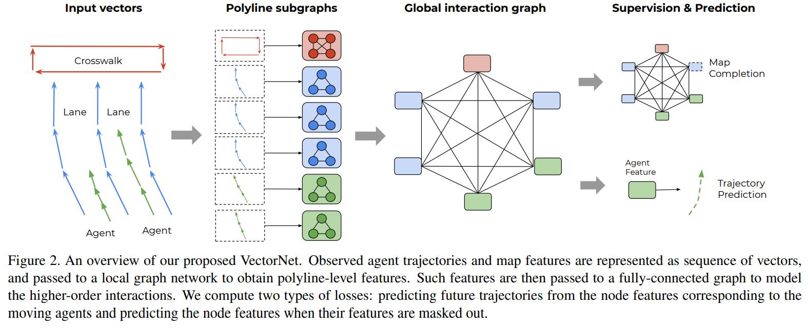

time: 20211022
pdf_source: https://openaccess.thecvf.com/content_CVPR_2020/papers/Gao_VectorNet_Encoding_HD_Maps_and_Agent_Dynamics_From_Vectorized_Representation_CVPR_2020_paper.pdf

# VectorNet: Encoding HD Maps and Agent Dynamics from Vectorized Representation

这篇paper是车辆的轨迹预测中值得关注的思路

主要的思路是使用多项式去表达临近车道，并使用GNN/attention去融合道路信息，而不是用图像级别的rasterized HD map.

