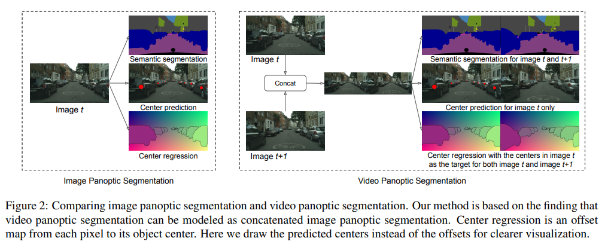
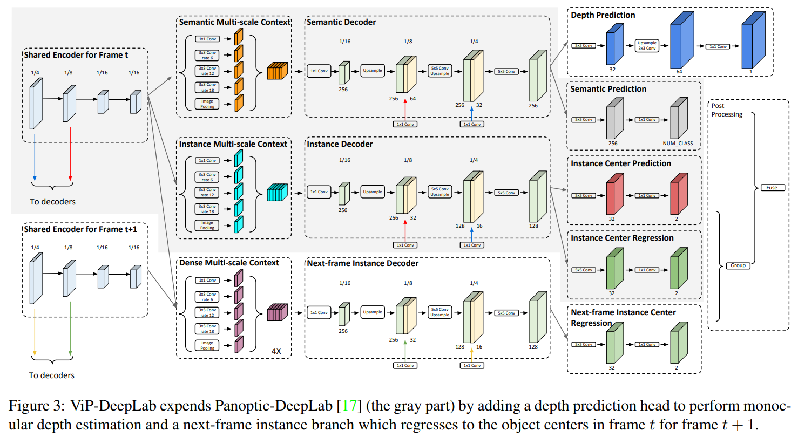

time: 20201216
pdf_source: https://arxiv.org/pdf/2012.05258.pdf
code_source: https://github.com/joe-siyuan-qiao/ViP-DeepLab

# ViP-DeepLab: Learning Visual Perception with Depth-aware Video Panoptic Segmentation

这篇paper主要研究的是视频中的panoptic segmentation. 比较奇妙的是最终还能达到单目深度估计的SOTA结果.

## 任务描述

在视频中，全景分割的每一个instance被描述为一个带有时间维的tube, 本文提出了Video Panoptic Quality (VPQ) 作为评判标准,其定义为

$$
    \text{VPQ}^k = \frac{1}{N_{classes}} \sum_c \frac{\sum_{(u,\hat u) \in \text{TP}_c} \text{IoU}(u, \hat u)}{|TP_c| + \frac{1}{2}|FP_c| + \frac{1}{2} |FN_c|}
$$

其中$\text{TP} = \{ (u, \hat u) \in U \times \hat U : \text{IoU} (u, \hat u) > 0.5 \}$

本文全景分割的算法继承 panoptic-DeepLab， 分成三个子任务:

- 对"thing" 与 "stuff"进行语义分割
- 对每一个"thing"的instance, 预测其中心pixel
- 对每一个"thing" 的pixel预测它到其instance 中心的距离。

推理的时候基于第二个任务以及第三个任务实现对同instance 像素的聚类。

## 网络结果

这篇paper提出的网络架构可以同时推理两张图，并进行深度预测.

深度预测选择的loss:

$$
\mathcal{L}_{depth}(d, \hat d) = \frac{1}{n}\sum_i(\log d_i - \log \hat d_i)^2 - \frac{1}{n^2}(\sum_i \log d_i - \log \hat d_i)^2 + (\frac{1}{n} \sum_i (\frac{d_i - \hat d_i}{d_i})^2)^0.5
$$