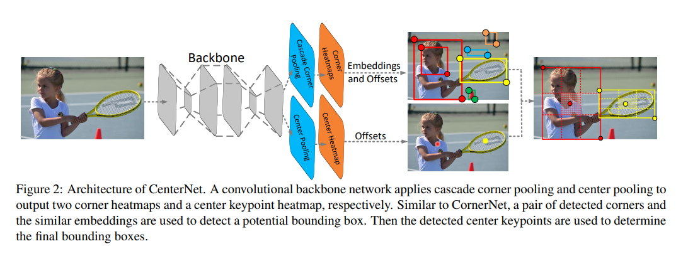

time: 20191024
pdf_source: https://arxiv.org/pdf/1904.08189.pdf
code_source: https://github.com/Duankaiwen/CenterNet
short_title: CenterNet
# CenterNet: Keypoint Triplets for Object Detection

CenterNet也就是通过输出每一个object为左上角、右上角与中心点的一个triplet,这个思路源自于[CornerNet](../Building_Blocks/CornerNet_Detecting_Objects_as_Paired_Keypoints.md)。

## 总体结构与pipeline

