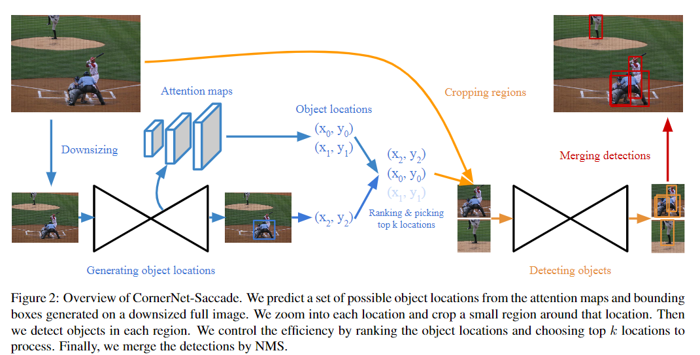

pdf_source: https://arxiv.org/pdf/1904.08900.pdf
code_source: https://github.com/princeton-vl/CornerNet-Lite
# CornerNet-Lite: Efficient Keypoint Based Object Detection

这篇论文在进行object detection的时候，使用的是基于keypoint的方法而不是基于proposal的方法。建议先阅读[这篇论文](../Building_Blocks/CornerNet_Detecting_Objects_as_Paired_Keypoints.md)

## 网络结构

使用attention map预测一系列不同scale的keypoint，在这个keypoint周围crop出一定量的方块图，进行分类、汇总，然后进行NMS。

