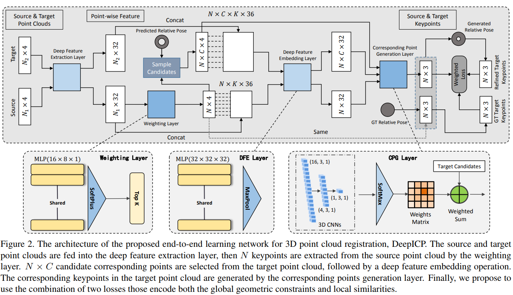

time: 20191012
pdf_source: https://arxiv.org/pdf/1905.04153.pdf
code_source:
short_title: DeepICP
# DeepICP: An End-to-End Deep Neural Network for 3D Point Cloud Registration

端到端方法实现基于keypoint的点云ICP,输入是两帧相邻的点云，一个对于相对运动的初始估计。

## 整体结构

## 特征提取层

两帧点云首先输入到一个共用的特征提取网络。使用的网络与PointNet++一致。作者的一个理论是说这里会带有一些语义信息，这些语义信息可以有效地帮助避免动态物体。

## 点加权

理论上来说，具有强特征的点应该会分配更大的权重。这里的做法是对每一个点进行三层全连接，前面两层带有batchnorm以及ReLU，最后一层softplus激活:$y = ln(1 + e^x)$,最后选出输出权重最大的N个点，这些点以及对应的权重在后续继续使用。

## 深度特征提取(embedding)

使用一个mini-PointNet(有待引用说明), 对前面提出的N个keypoint，在半径为$d$的范围内，收集K个临近点(可重复),对这些点，把他们的相对坐标normalized by $d$，再加上lidar强度，这些特征与特征提取层的特征concat，

mini-pointNet 由三层全连接和max-pooling组成，输入是$N\times K \times 36$的矢量，输出是一个,输出仍然是$N\times 32$维的向量 

## 对应点生成

传统ICP直接选择最靠近的点最为对应点，这使得反向传播无法进行，而且由于点云的稀疏特性，很多时候根本不存在对应点，这里提出了使用CPG层.

首先将N个在源点云的keypoint通过预估计的转移矩阵进行一次坐标变换。在转换后的位置上，将它的临近空间分为$(\frac{2r}{s} + 1, \frac{2r}{s} + 1, \frac{2r}{s} + 1)$ 3D网格，每一个网格的中心{$y^{'}_j, j=1,...,C$}可理解为可能的对应点，与前文深度特征提取一致，使用特征提取得到$N\times C \times 32$的矢量。来自源域与目标域的特征送到3D CNN + softmax中，目标是学习一个similarity distance metric.

## Loss 函数

1. 对于每一个keypoint，我们通过GT可以知道它最后的cooresponding points，用GT的对应点与预测的对应点之间的误差可以给出一个Loss
2. 将所有的对应点融合起来，可以用SVD求出R，T，用RT代替预测的对应点求出第二个loss，Tensorflow提供了可微分的SVD实现，
3. 最终loss为两者的融合