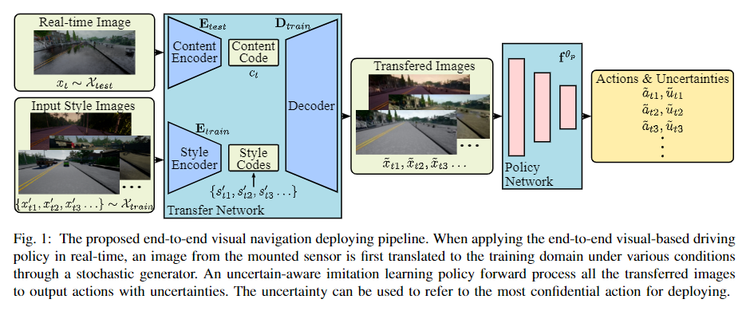

# End-to-end Driving Deploying through Uncertainty-Aware ImitationLearning and Stochastic Visual Domain Adaptation

这是一篇本实验室师兄的一篇文章。讲的是端到端的带有不确定性估计的模仿学习以及transfer learning的作用

## 带有不确定性估计的模仿学习

将回归任务转化为以下方程:

$$[y, \sigma] = f^\theta(x)$$
$$L(\theta)=\frac{1}{2} \frac{||y-\hat y||^2}{\sigma^2} + \frac{1}{2}log \sigma^2$$

方程一是神经网络的forward pass，方程二是回归的cost function。

## real-to-sim 转换

师兄的另一篇论文又提到使用Real-to-sim的实时转换，可以让在simulation下训练的agent在面对现实得到的图片时有更好的表现。本文的思路是将测试domain转换到训练的三个domain中，并分别给出输出。