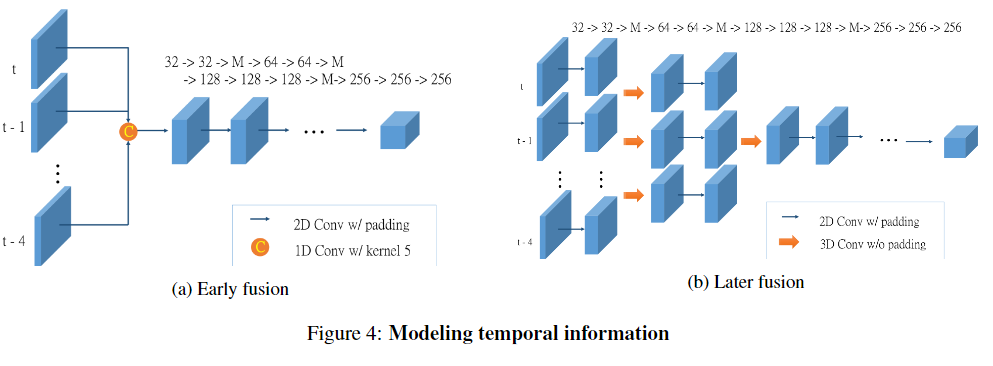
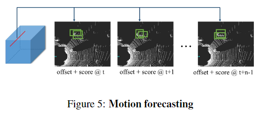

pdf_source: http://openaccess.thecvf.com/content_cvpr_2018/papers/Luo_Fast_and_Furious_CVPR_2018_paper.pdf
short_title: Fast and Furious
# Fast and Furious: Real Time End-to-End 3D Detection, Tracking and MotionForecasting with a Single Convolutional Net

这篇论文的关键是结合时序信息，要同时实现3D detection以及tracking甚至forecasting,使用单一的Lidar数据

## 点云信息的处理办法

将单帧点云转换为2Dcostmap，点的高度作为输入的一个feature。

将多帧点云转换到同一个坐标系中，每一帧可以单独形成一个3D Tensor，结合起来成为一个4D Tensor

## 融合时序信息的方法

第一种方法是Early Fusion,在一开始就使用1D Conv将多个Costmap结合成一个Costmap

第二种方法是Late Fusion,使用3D Conv分两步结合。

## 输出bounding box 以及预测

直接输出一系列的bounding box和种类信息
