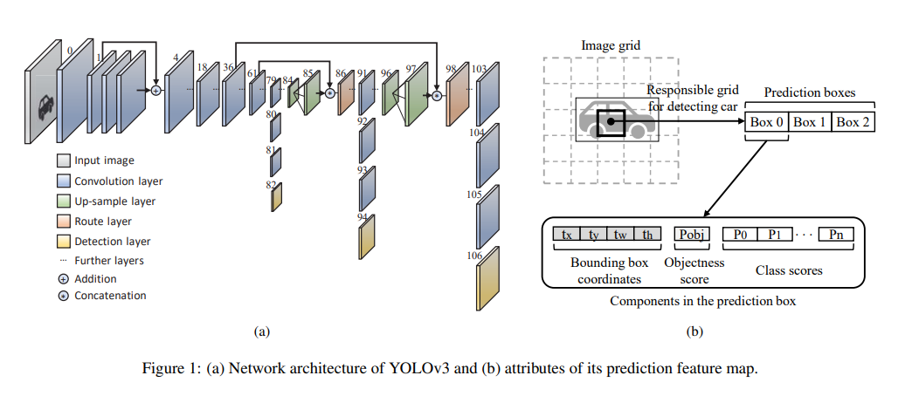
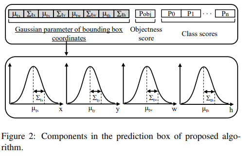

time: 20191031
pdf_source: http://openaccess.thecvf.com/content_ICCV_2019/papers/Choi_Gaussian_YOLOv3_An_Accurate_and_Fast_Object_Detector_Using_Localization_ICCV_2019_paper.pdf
code_source: https://github.com/jwchoi384/Gaussian_YOLOv3
short_title: Gaussian YOLOv3
# Gaussian YOLOv3: An Accurate and Fast Object Detector Using Localization Uncertainty for Autonomous Driving

这篇论文引入了Gaussian Yolov3,在inference中预测定位的不确定性，减少了False Positive,以提升点数。这个论文的主要思路贡献在于，在inference的时候通过对边框的不确定性的估计修正inference时的估计。使得NMS时会真正选择对位置确定性最高的框。

## Gaussian Yolov3 结构

Yolov3回归输出的bbox结构包括$t_x, t_y, t_w, t_h$,这样可以用高斯模型来估计。本文的算法输入如图

### 输出结构

$$
\begin{aligned} \mu_{t_{x}}=\sigma\left(\hat{\mu}_{t_{x}}\right), \mu_{t_{y}} &=\sigma\left(\hat{\mu}_{t_{y}}\right), \mu_{t_{w}}=\hat{\mu}_{t_{w}}, \mu_{t_{h}}=\hat{\mu}_{t_{h}} \\ \Sigma_{t_{x}} &=\sigma\left(\hat{\Sigma}_{t_{x}}\right), \Sigma_{t_{y}}=\sigma\left(\hat{\Sigma}_{t_{y}}\right) \\ \Sigma_{t_{w}} &=\sigma\left(\hat{\Sigma}_{t_{w}}\right), \Sigma_{t_{h}}=\sigma\left(\hat{\Sigma}_{t_{h}}\right) \\ \sigma(x) &=\frac{1}{(1+\exp (-x))} \end{aligned}
$$

### 损失函数

这里用negative log likelihood损失

$$
\begin{aligned}
    L_x = - \sum_{i=1}^W  \sum_{j=1}^H  \sum_{k=1}^K
    \gamma_{ijk}log(N&(x^G_{jik}|\mu_{t_x}(x_{ijk}))),\\
    &\sum_{t_x}(x_{ijk})) + \epsilon)
\end{aligned}
$$

其中W,H,为grids输出,K是anchors的数量.

### inference

当输出的时候,inference时将各个index的不确定性取均值，这样会对类别的class score,会形成影响.

$$
C r .=\sigma(\text {Object}) \times \sigma\left(\text {Class}_{i}\right) \times\left(1-\text {Uncertainty}_{\text {aver}}\right)
$$