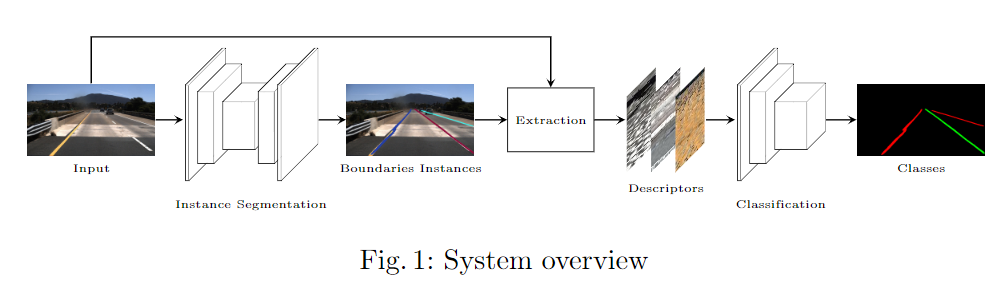

# Lane Detection and Classification usingCascaded CNNs

这篇论文给出的是端到端路线点的分割、聚类以及分类的算法。

整体结构如图

## 1. Instance Segmentation
用物体分割做第一步，只探测最多4条线。中心两条以及左右一条。

## 2. 分类
数据上使用额外的人工标注，得到图森数据集的道路线类别，[github](https://github.com/fabvio/TuSimple-lane-classes)

从Segmentation的点中找到原图上的点，从中采样固定数量的点(作为稳定的输入大小)。

把这些descriptor(固定数量)输入到另一个单独训练的CNN中完成分类。