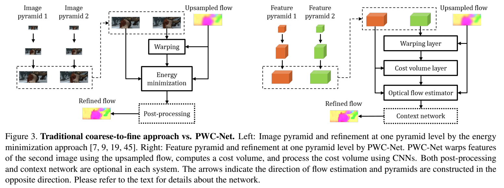

code_source: https://github.com/NVlabs/PWC-Net
pdf_source: https://arxiv.org/pdf/1709.02371.pdf
short_title: PWC-Net
# PWC-Net: CNNs for Optical Flow Using Pyramid, Warping, and Cost Volume

这篇论文是[Joint Unsupervised Learning of Optical Flow and Depth by Watching Stereo Videos](Joint_Unsupervised_Learning_of_Optical_Flow_and_Depth_by_Watching_Stereo_Videos.md)的前置

## 网络结构

输入的特征分为6层，第一层为输入图片，第二层开始为ConvNet下采样的输出, 输出光流

## Warping Layer

在第L层，将第二张图第l+1层的feature通过上采样转换到第一张图 
$$c^l_w(x) = c^l_2(x + up_2(w^{l+1})(x))$$
采用的是bilinear interpolation

## Cost volume layer

表示的是一个pixel与下一时刻对应pixel match的cost。使用特征的coorelation来表示

$$cv^l(x1, x2) = \frac{1}{N} (c^l_1(x_1))^T c^l_w(x_2)$$

具体：输出是$d^2\times H^l \times W^l$其实就是左视角每一个点$x_1$与warp结果对应周围$d\times d$个pixels的特征向量求相关性

## Optical flow estimator

这是一个多层CNN，输入是Cost Volumn, 第一图的特征以及上采样的光流，它的输出是第$l$层的光流$w^l$.不同层之间的CNN特征不共享，

##　Context Network

使用最终输出的光流以及前一层的特征作为输入，再输出更精确的光流值，多使用dilated Conv去提升感受野