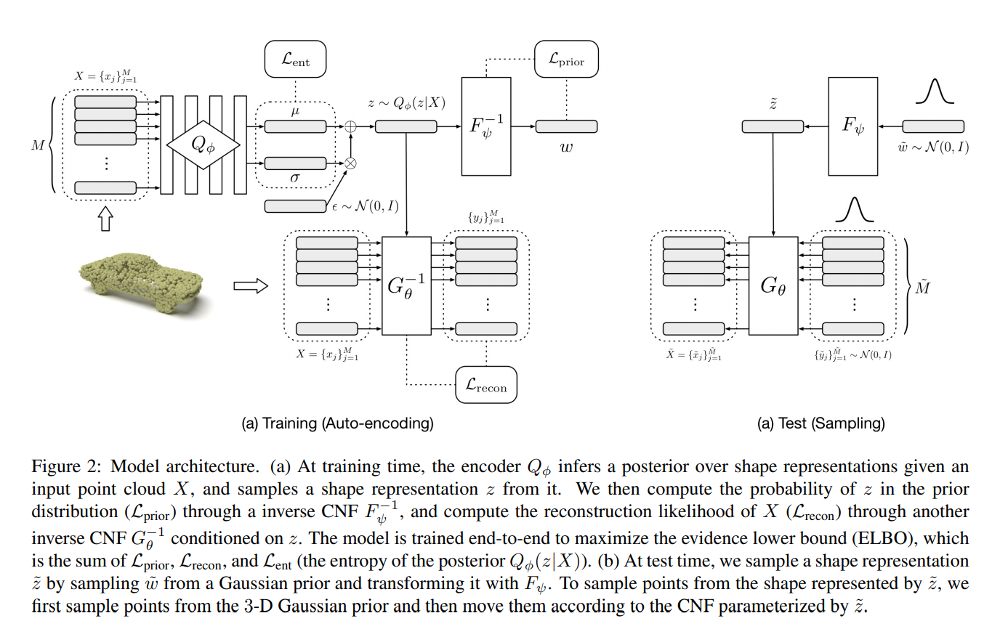

time: 20191015
pdf_source: https://arxiv.org/pdf/1906.12320.pdf
code_source: https://github.com/stevenygd/PointFlow
short_title: PointFlow
# PointFlow : 3D Point Cloud Generation with Continuous Normalizing Flows

这篇论文有一个[project page](https://www.guandaoyang.com/PointFlow/)，根据[视频](https://youtu.be/jqBiv77xC0M)完成的一个任务可以这样描述。每一个物体的一种点云表达可以理解为从一个由形状决定的概率分布采样点。我们可以利用一个坐标转换函数，将高斯采样点云转换为最后的输出。本文给出的网络可以根据类别，以及一些随机数，采样出不同形状的一个坐标转换函数。

##  Background: Continuous normalizing flow

定义$f_1,...,f_n$指代一系列的可逆变换。输入隐变量$y$的概率分布为$P(y)$.$x=f_{n} \circ f_{n-1} \circ \cdots \circ f_{1}(y)$作为输出。输出变量的概率密度则变为
$$
\log P(x)=\log P(y)-\sum_{k=1}^{n} \log \left|\operatorname{det} \frac{\partial f_{k}}{\partial y_{k-1}}\right|
$$
这样$y$可以从$x$使用inverse flow计算:$y=f_{1}^{-1} \circ \cdots \circ f_{n}^{-1}(x)$.

这里$f_1,...,f_n$在这里实体化作为神经网络，这样导数的行列式计算难度不大。

continuous normalizing flow(CNF) for $P(x)$就是

$$
x=y\left(t_{0}\right)+\int_{t_{0}}^{t_{1}} f(y(t), t) d t, \quad y\left(t_{0}\right) \sim P(y)
$$

$$
\log P(x)=\log P\left(y\left(t_{0}\right)\right)-\int_{t_{0}}^{t_{1}} \operatorname{Tr}\left(\frac{\partial f}{\partial y(t)}\right) d t
$$

inverse flow $y(t_0) = x + \int^{t_0}_{t_1}f(y(t),t)dt$.这里的$f$仍然是一个神经网络,用ODE求解器作为输出。这里的关键思维转变是利用了，[Neural Ordinary Equation](https://arxiv.org/pdf/1806.07366.pdf)的思路，将连续叠层的共享权重的神经网络用常微分方程代替.用这个neural ODE的一个重点是使得逆变换可以同样通过ODE时间上相反的一个forward pass实现。

## Variational auto-encoder

[原文](https://arxiv.org/pdf/1312.6114.pdf).VAE中，$z$是latent space,包含一个描述$P_\theta(X|z)$作为decoder,还学习一个encoder$Q_\phi(z|X)$,它们共同训练去最大化观察器的log-likelihood

$$
\begin{aligned} \log P_{\theta}(X) & \geq \log P_{\theta}(X)-D_{K L}\left(Q_{\phi}(z | X) \| P_{\theta}(z | X)\right) \\ &=\mathbb{E}_{Q_{\phi}(z | x)}\left[\log P_{\theta}(X | z)\right]-D_{K L}\left(Q_{\phi}(z | X) \| P_{\psi}(z)\right) \\ & \triangleq \mathcal{L}(X ; \phi, \psi, \theta) \end{aligned}
$$

$z = \mu_phi(X) + \sigma_\phi(X)  \epsilon$.这个均值与方差都是网络直接的输出。

## 本文提出的方法

首先包含三个模块，第一个是encoder，$Q_\phi(z|X)$,将点云编码为一个隐变量$z$,一个先验 $P\psi(z)$ over shapes.然后一个decoder, $P_\theta(X|z)$.

### point generation from shape representations

$$
\log P_{\theta}(X | z)=\sum_{x \in X} \log P_{\theta}(x | z)
$$

具体来说，一个在集合$X$中的点$x$，是使用CNF conditioned on $z$,转换$y(t_0)$的结果,也就是neural ODE的forward pass。

$$
x=G_{\theta}\left(y\left(t_{0}\right) ; z\right) \triangleq y\left(t_{0}\right)+\int_{t_{0}}^{t_{1}} g_{\theta}(y(t), t, z) d t, y\left(t_{0}\right) \sim P(y)
$$

这里$g_\theta$定义为flow $G_\theta$的连续动力学。
$G_{\theta}^{-1}(x ; z)=x+\int_{t_{1}}^{t_{0}} g_{\theta}(y(t), t, z) d t$ with $y(t_1)=x$

###　 Flow-based 先验 over shapes

回顾KL-divergence(相对熵)，
$$
D_{KL}(p||q) = H(p, q) - H(p)
$$

forward时:

$$
z=F_{\psi}\left(w\left(t_{0}\right)\right) \triangleq w\left(t_{0}\right)+\int_{t_{0}}^{t_{1}} f_{\psi}(w(t), t) d t, w\left(t_{0}\right) \sim P(w)
$$

### 最终training 目标

ELBO:VAE目标
$$
\begin{aligned} \mathcal{L}(X ; \phi, \psi, \theta) &=\mathbb{E}_{Q_{\phi}(z | x)}\left[\log P_{\psi}(z)+\log P_{\theta}(X | z)\right]+H\left[Q_{\phi}(z | X)\right] \\ &=\mathbb{E}_{Q_{\phi}(z | X)}\left[\log P\left(F_{\psi}^{-1}(z)\right)-\int_{t_{0}}^{t_{1}} \operatorname{Tr}\left(\frac{\partial f_{\psi}}{\partial w(t)}\right) d t\right.\\ &\left.+\sum_{x \in X}\left(\log P\left(G_{\theta}^{-1}(x ; z)\right)-\int_{t_{0}}^{t_{1}} \operatorname{Tr}\left(\frac{\partial g_{\theta}}{\partial y(t)}\right) d t\right)\right] \\ &+H\left[Q_{\phi}(z | X)\right] \end{aligned}
$$

可以分解为三个部分

Prior:鼓励大概率，较确定的结果(这里用单次蒙特卡洛采样对那个期望进行估计)
$$
\mathbb{E}_{Q_{\phi}(z | x)}\left[\log P_{\psi}(z)\right] \approx \frac{1}{L} \sum_{l=1}^{L} \log P_{\psi}\left(\mu+\epsilon_{l} \odot \sigma\right)
$$

Reconstruction:
$\mathcal{L}_{\mathrm{recon}}(X ; \theta, \phi) \triangleq \mathbb{E}_{Q_{\phi}}(z | x)\left[\log P_{\theta}(X | z)\right]$

Posterior Entropy:
$\mathcal{L}_{\mathrm{ent}}(X ; \phi) \triangleq H\left[Q_{\phi}(z | X)\right]=\frac{d}{2}(1+\ln (2 \pi))+\sum_{i=1}^{d} \ln \sigma_{i}$

本文模型需要最大化这个目标。

#### 总览

进一步细节解释：

图中的$Q_\phi$为类似pointNet结构的，encoder，是一维卷积，最后全连接输出两个$D_z$维度的均值与方差预测

$f_\phi$使用的是[FFJORD](https://arxiv.org/pdf/1810.01367.pdf),里面使用了三个concatsquash层
$$
\mathrm{CS}(x, t)=\left(W_{x} x+b_{x}\right) \sigma\left(W_{t} t+b_{t}\right)+\left(W_{b} t+b_{b} t\right)
$$

$g_\theta$处拓展了concatsquash层以使得结果与z相关
$$
\begin{aligned} \operatorname{CCS}(x, z, t)=&\left(W_{x} x+b_{x}\right) \sigma\left(W_{t t} t+W_{t z} z+b_{t}\right) \\ &+\left(W_{b t} t+W_{b z} z+b_{b} t\right) \end{aligned}
$$

