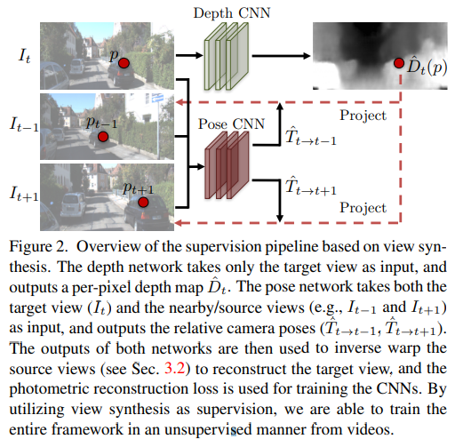

pdf_source: https://people.eecs.berkeley.edu/~tinghuiz/projects/SfMLearner/cvpr17_sfm_final.pdf
code_source: https://github.com/tinghuiz/SfMLearner
short_title: 
# Unsupervised Learning of Depth and Ego-Motion from Video

这篇文章对我来说说是[这篇文章](Joint_Unsupervised_Learning_of_Optical_Flow_and_Depth_by_Watching_Stereo_Videos.md)的前置

这篇文章解决的问题也是输入视频，输出深度与相机运动的估计

# 主pipeline

使用相邻三张图，将当前$I_t$输入到Depth CNN输出深度图，将相邻的$I_{t-1}, I_{t+1}$共三张图输入到pose CNN(CNN直接输出六自由度运动)中输出前后两个相对pose，在已知当前图的深度以及运动，将当前图转换到前后时刻的图片上(使用bilinear intepolation进行可导的转换)

本文还有更多内容如(Explainability mask)，此处讨论到此为止。